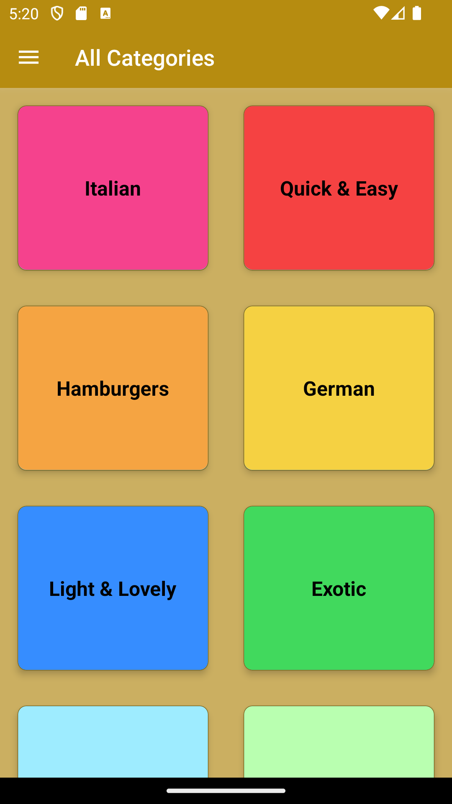
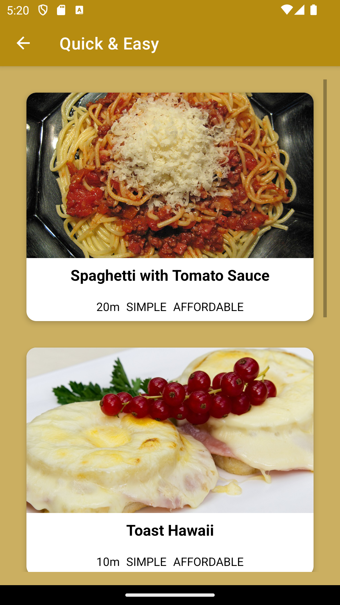
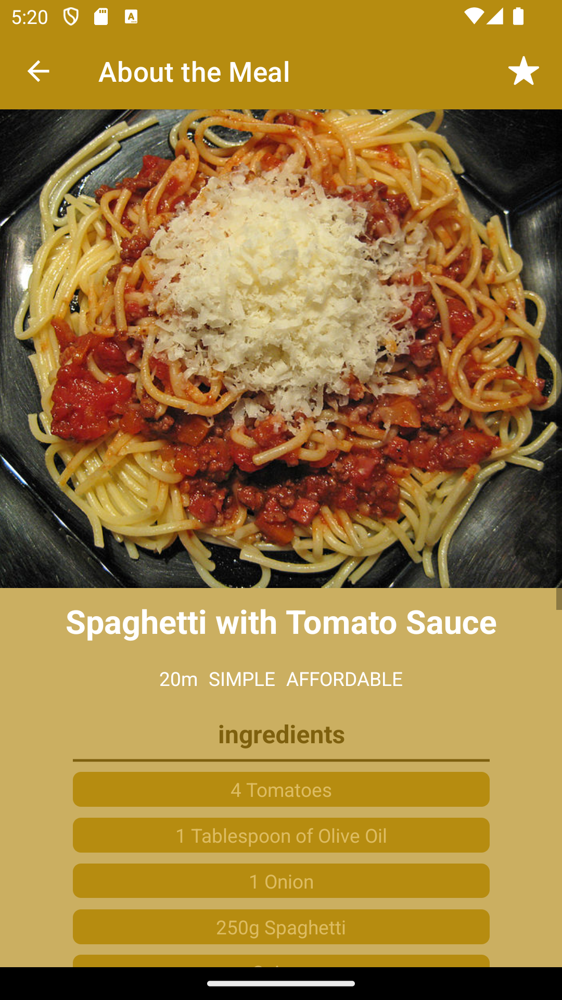
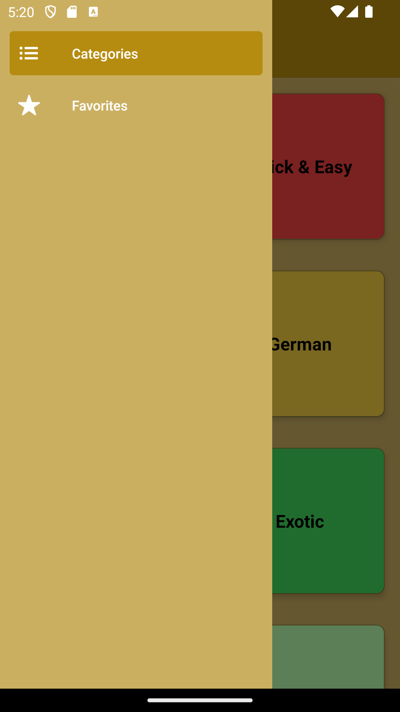
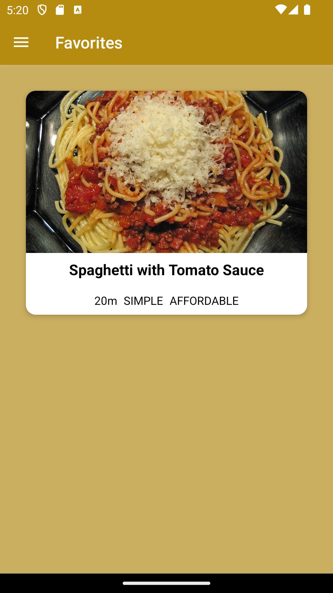

# Meal App - React Native Project

## Description

This is a React Native project for a meal app that allows users to see various meals. The app utilizes React Navigation for navigation, Redux Toolkit/Context API for state management, and integrates videos within the project.

## Features

- Browse a variety of meals.
- View meal details.
- Save favorite meals.

## Technologies Used

- React Native
- React Navigation
- Redux Toolkit / Context API

## Screenshots

  
  
  
  
  

https://github.com/sheikhabdulmoiz/Meal-Application/assets/106825649/372e52f3-df87-4827-a560-672b307fb494

